 

# Olá, eu sou Gabriel Poças 👋

**Analista de Dados · Software Builder · Open Source Contributor**

Transformo processos manuais, planilhas e informações espalhadas em ferramentas, automações e sistemas que ajudam no trabalho real.

---

## Sobre mim

- trabalho com **dados e software em ambiente industrial**;
- gosto de transformar gargalos operacionais em **sistemas simples e úteis**;
- desenvolvo principalmente com **PHP, MySQL, JavaScript e Linux**;
- mantenho projetos próprios e também contribuo com **open source**;
- atualmente estudando e praticando **backend, redes, Linux e arquitetura de sistemas**.

## Stack

  

## GitHub

  
  

  

## Projetos em destaque

  
  

### AppFoundry

Base **secure-by-default** em PHP 8.3 para aplicações internas self-hosted. Já traz autenticação, sessões, CSRF, autorização, rate limiting, auditoria, Docker e CI para que um fork possa começar pela regra de negócio.

### Outros projetos

| Projeto | O que é |
| --- | --- |
| **[php-security-kit](https://github.com/ymuft/php-security-kit)** | Camada PHP para sessões, CSRF, rate limiting e controle de acesso. |
| **[erp](https://github.com/ymuft/erp)** | Base modular de CRM/ERP construída com PHP e MySQL. |
| **[clinera](https://github.com/ymuft/clinera)** | Utilitários Batch + PowerShell para tarefas repetitivas no Windows. |

## Open source

Algumas contribuições fora dos meus próprios repositórios:

- [RunnerDeck — login lockout countdown](https://github.com/AnikethTS/RunnerDeck/pull/71)
- [Moodle AI Skill Navigator — Windows PowerShell quick start](https://github.com/Berserk-hub150/moodle-ai-skill-navigator/pull/229)
- [Moodle AI Skill Navigator — course materials troubleshooting](https://github.com/Berserk-hub150/moodle-ai-skill-navigator/pull/230)

## Atualmente

`industrial tooling` · `capacity planning` · `backend` · `linux` · `networking` · `open source`

---

  Software útil, menos trabalho manual e mais tempo para resolver o que realmente importa.

